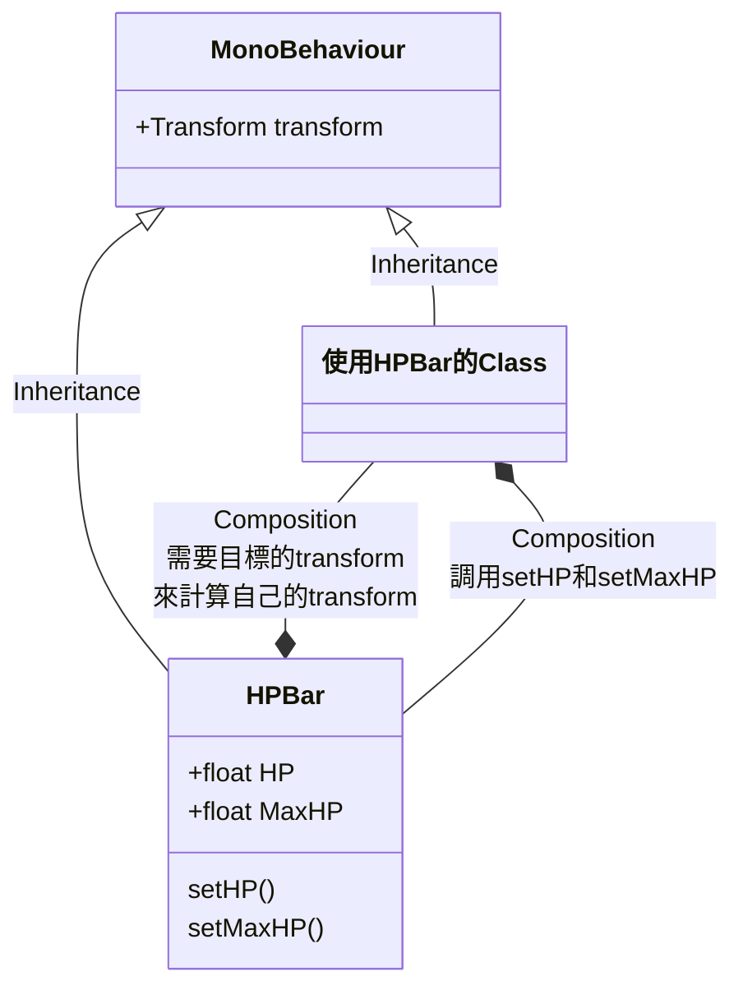
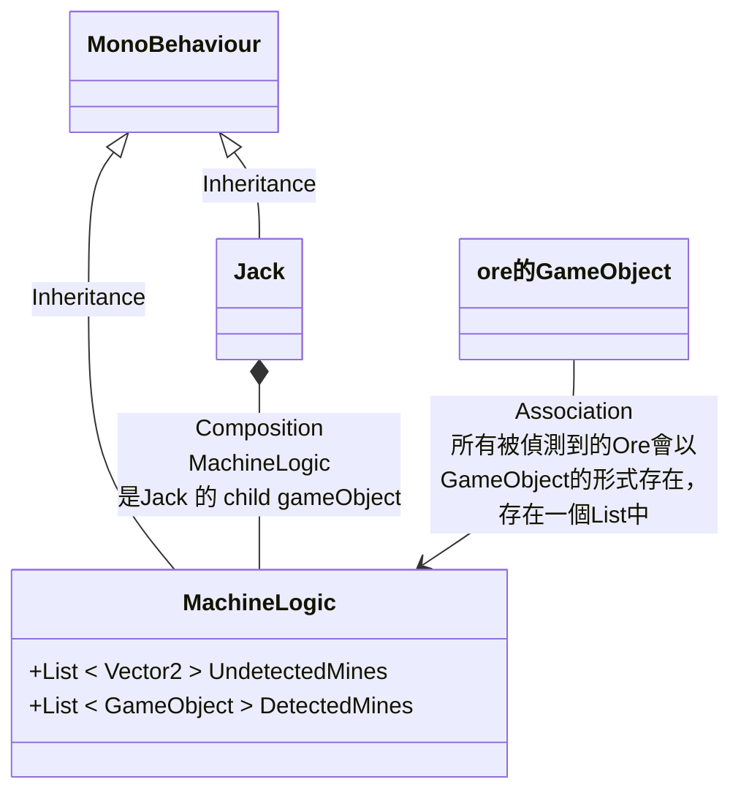

# All Classes

下面是所有類別(Class)的列表，可以在對應的file中看到那個Class的用途。

| Classes |
| :- |
| [GlobalVariables](Assets/GlobalVariables.cs) |
| [CameraMovement](Assets/CameraMoment.cs) |
| [Explode](Assets/Explosion/Explode.cs) | 
| [FpsSliderLogic](Assets/Ingame%20Menu/FpsSliderLogic.cs) |
| [MenuManager](Assets/Ingame%20Menu/MenuManager.cs) |
| [MouseInteract](Assets/Ingame%20Menu/MouseInteract.cs) |
| [OptionMenu](Assets/Ingame%20Menu/OptionMenu.cs) |
| [VolumeSliderLogic](Assets/Ingame%20Menu/VolumeSliderLogic.cs) |
| [mainMenuLogic](Assets/MainMenu/MainMenuLogic.cs) | 
| [Bullet](Assets/WorldFight/Bullet/Bullet.cs) |
| [Wills1](Assets/WorldFight/Wills1/Wills1.cs) |
| [Gun](Assets/WorldFight/Gun.cs) |
| [HPBar](Assets/WorldFight/HPBar.cs) |
| [Jack](Assets/WorldFight/Jack.cs) |
| [JackMining](Assets/WorldMining/JackMining.cs) |
| [MachineLogic](Assets/WorldMining/MachineLogic.cs) |
| [MapSceneSwitcher](Assets/WorldMining/MapScenesSwicher.cs) |

# 一些比較複雜的class或是gamerObject的UML

### HPBar

HPBar 就是就血條

### MachineLogic

負責控制ore的生成、位置、和玩家的互動計算

